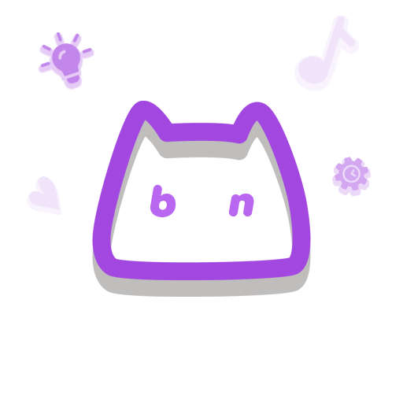

# BN Manager

A program for managing the BN nomination requests for your beatmaps,  
written in WASDK/WinUI 3.

[Usage](#usage) • [Demo](#demo) 

<i>Made with ❤️ by minisbett</i>

## Usage

to be added

## Demo

to be added
